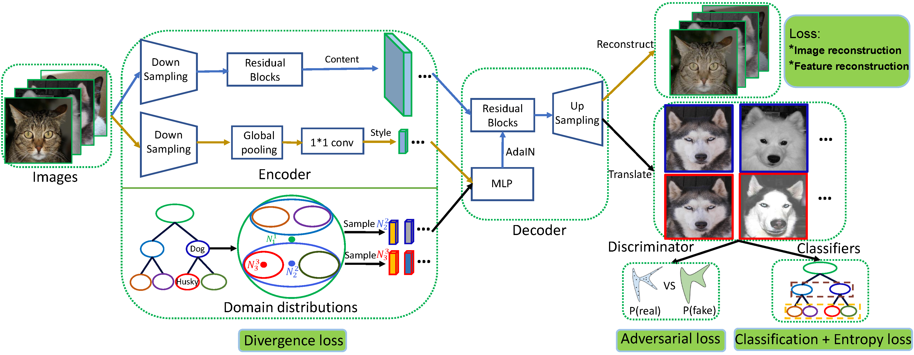

# HIT
Official Pytorch implementation of "Hierarchical image-to-image translation with nested distributions modeling".

The framework of our proposed method HIT:



## Requirements

Please prepare the requirements by following the command.
```
pip install -r requirements.txt
```

## Train HIT models
### Prepare datasets
We use public benchmark datasets: a subset of ImageNet, and ShapeNet. We have preprocessed these two 
datasets and provided both the raw images and the annotations files for direct training and testing. You can 
download them from [Baidu Cloud Drive](https://pan.baidu.com/s/1kTD5MFVfeaFyXh_n0_sm6Q) using the extraction codes：ibcc.
In the future, we will provide a download link on Google Drive.

The training and testing settings on each dataset are shown in the configs folder, i.e., 
imagenet.yaml and furniture.yaml. You should change some settings such as the 'model_name', 
 paths of files when training different models.


Examples
- Train the HIT model with ImageNet.
- ```
  python train.py --config=./configs/imagenet.yaml
  ``` 

- Train the HIT model with ShapeNet.
- ```
  python train.py --config=./configs/furniture.yaml
  ```


## Evaluation
### Translation Results 
- ```
  python test_batch.py --config=./configs/imagenet.yaml --checkpoint=./outputs/model_name/checkpoints/checkpoint_80000.pt --save_name feature_file_name
  ``` 
>>This operation will help you obtain the hierarchical translation results for each test image.

### Quantitative evaluation
- FID
- ```
  python fid.py /path/to/real_image_folders  /path/to/generated_image_folders --gpu 0
  ```
>>This operation will help you compute the FID between real image set and generated image sets. For LPIPS computation, you can turn to the official LPIPS project.

- Classification Accuracy
- ```
  python test_cls_acc.py
  ```
>>We provide this script to evaluate the classification accuracy of generated images at the middle level. When you use this script, you should modify some path settings of
> data, classfication modesl, etc. Besides, you can train the classfier with the provided codes 'train_alexnet_cls.py'.


### Our Pretrained HIT models

We release our pretrained models for reference on the [Baidu Cloud Drive](https://pan.baidu.com/s/1sjtE4WHCtUWm00n7XdVxAA) with extraction codes: ibcc.

## Contact
If you have any problem with our code, feel free to contact [shishi.qiao@vipl.ict.ac.cn](mailto:shishi.qiao@vipl.ict.ac.cn),
 [qiaoshishi@ouc.edu.cn](mailto:qiaoshishi@ouc.edu.cn)
or describe your problem in Issues.


